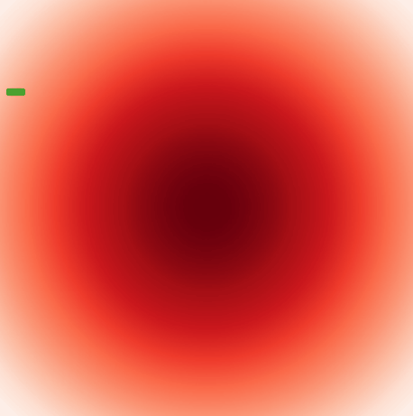

# Gradient Ascent

Gradient Ascent is a library for modelling different gradient ascent strategies on a 2d grid representing an elevation map. 

## Set up

Fork this repo and clone a local copy. 

```bash
git clone https://github.com/JRainbowOS/GradientAscent.git
```

Create and activate a new python virtual environment before installing the dependencies.

```bash
python -m venv venv
pip install -r requirements.txt
venv/Scripts/activate
```

## Usage

Run ```summitter.py``` to see an example animation and a heatmap of all the cells that will make a full ascent to the global summit. 


## Contributing
Pull requests are welcome. For major changes, please open an issue first to discuss what you would like to change.

Please make sure to update tests as appropriate.

## Tests

To run all tests, run the following command in the python console. 
```bash
pytest -vv
```
## License
[MIT](https://choosealicense.com/licenses/mit/)


